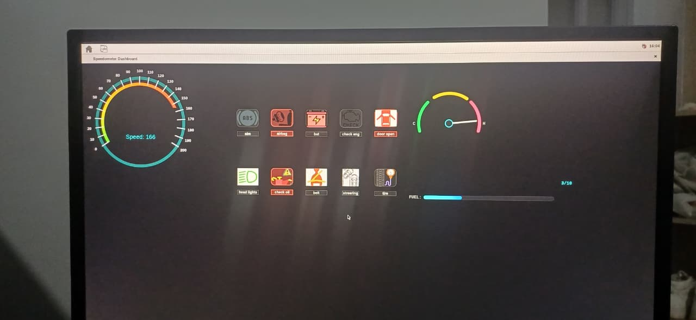

# Speedometer

A PyQt5-based automotive dashboard designed for Embedded Linux systems. The application provides a modern digital speedometer interface and has been successfully deployed on a custom Yocto Linux image running on a Raspberry Pi 5.

## Overview

This project demonstrates the complete workflow of taking a desktop Python application and deploying it as an Embedded Linux application using the Yocto Project.

The dashboard is intended as a foundation for automotive Human-Machine Interface (HMI) development and can be extended to interface with real vehicle sensors through serial communication.

## Features

* PyQt5-based automotive dashboard
* Analog speedometer gauge
* Digital speed display
* Automotive warning indicators
* Real-time speed updates
* UART serial communication support
* Deployable on Embedded Linux
* Yocto Project compatible

## Hardware

* Raspberry Pi 5
* Arduino (serial data source)
* HDMI display (or Raspberry Pi display)

## Software Stack

* Python 3
* PyQt5
* Qt Serial Port
* Yocto Project
* BitBake
* Raspberry Pi 5
* Git

## Project Structure

```text
speedometer/
├── icons/
├── arduino_data.py
├── dashboard.py
├── display_symbols.py
├── fuel_tmp.py
├── stick_display.py
└── radio.ui
```

## Running on Desktop

Clone the repository:

```bash
git clone https://github.com/Mark-Kitur/speedometer.git
cd speedometer
```

Install the package:

```bash
pip install .
```

Launch the application:

```bash
spedo
```

Alternatively:

```bash
python -m speedometer.dashboard
```

## Running on Yocto

The application can be integrated into a custom Yocto image through a BitBake recipe.

After installation on the target device, launch it with:

```bash
spedo
```

## Serial Communication

The dashboard receives speed data over UART using Qt Serial Port.

Example:

```
Arduino
     │
     │ UART
     ▼
Raspberry Pi 5
     │
     ▼
PyQt5 Dashboard
```

Incoming serial values are converted into speed and rendered on the dashboard in real time.

## Screenshots

Add screenshots of:

* Dashboard running on desktop
* Dashboard running on Raspberry Pi 5
* Yocto deployment
* Real-time speed updates

## Future Improvements

* CAN bus support
* GPS speed input
* OBD-II integration
* Boot-time auto start
* Touchscreen optimization
* Additional vehicle telemetry
* ROS 2 integration

## Related Project

Custom Yocto Linux image used for deployment:

https://github.com/Mark-Kitur/mark_os

## Author

**Mark Kitur**

Embedded Systems | Embedded Linux | Robotics | Mechatronics


## License

This project is licensed under the MIT License.
